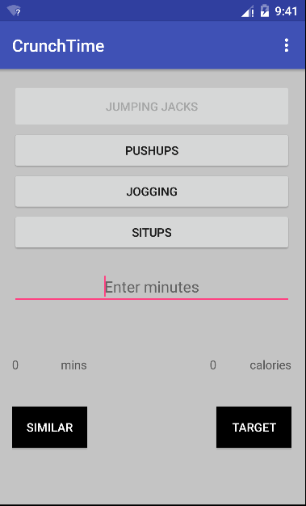
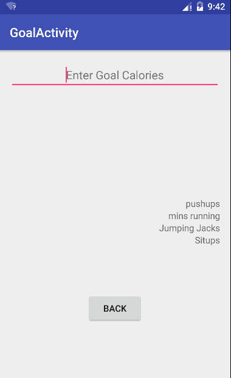

# PROG 01: Crunch Time

Crunch Time is an android app that will allow you to see how many calories you have burned doing some exercise. It also gives you  options for exercise if you enter the amount of calories that you want to burn.

## Authors

Hashmi Hamza ([hhashmi@berkeley.edu](mailto:hhashmi@berkeley.edu))

## Demo Video

See [CrunchTime] (https://www.youtube.com/watch?v=02f7Vga6LuA&feature=youtu.be)

## Screenshots

## Acknowledgments

* http://stackoverflow.com/questions/4377842/how-can-i-convert-integer-into-float-in-java
* http://stackoverflow.com/questions/1489852/android-handle-enter-in-an-edittext
* http://stackoverflow.com/questions/8753959/round-a-floating-point-number-to-the-next-integer-value-in-java
* https://www.youtube.com/watch?v=8NoHxfIu0MQ

*Feel free to enhance your README. For Markdown syntax, see [the GitHub Guides](https://guides.github.com/features/mastering-markdown/). Remove this line in your submission.*